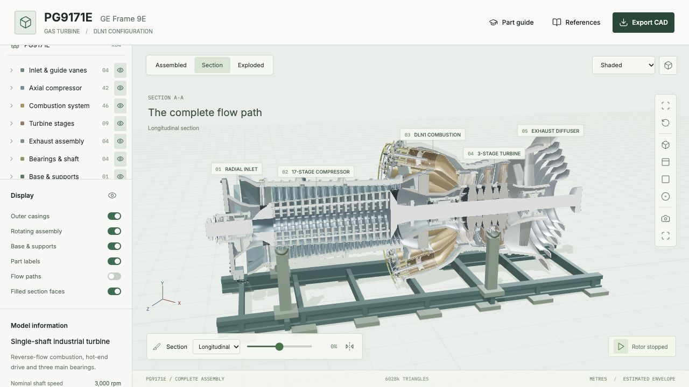

# PG9171E / GE Frame 9E Interactive Reconstruction

A local Three.js assembly viewer reconstructed from the supplied Oil Gas World PG9171E training video and public technical references. It models the historical three-stage turbine with DLN1 combustion, not the four-stage 9E.04 upgrade.



## Run

```sh
npm install
npm run dev
```

Open the URL reported by Vite, typically http://127.0.0.1:5173/.

```sh
npm run verify
npm run verify:topology
npm run build
node scripts/export-model.mjs
```

The production site is written to `dist/` and needs an HTTP server, such as `npm run preview`.

## Viewer

- Assembled, section, and continuously adjustable exploded views.
- Filled section faces with a display toggle, cavity-aware selection, and open bores preserved across all cut directions. Wireframe leaves section faces unfilled.
- Shaded, CAD-edge, transparent casing, and wireframe rendering.
- Orthographic/perspective projection, standard views, orbit/pan/zoom, and image capture.
- 110 selectable components with source timestamps, focus, isolation, and assembly visibility.
- Part guide with component-specific Function, Design and In service lessons, source links, and seven assembly overviews. Select a component in the model or tree to open it. Close with the X or Part guide button; the hidden preference persists across selections and reloads. Reopen with Part guide.
- Slow inspection rotation and illustrative flow particles. Particle paths describe the assembled flow and are hidden in exploded view; they are not a flow simulation.
- GLB and binary STL export of the full assembled model or the currently visible, separated components.
- Editable simplified parametric OpenSCAD source.

## Deliverables

The generated GLB and STL meshes are excluded from Git. Generate them locally with `node scripts/export-model.mjs`, or use Export CAD in the viewer. The OpenSCAD source and preview images are included.

- `exports/pg9171e.glb`: named, material-bearing visualization assembly, metres.
- `exports/pg9171e-mm.stl`: triangulated assembled surfaces, millimetres.
- `public/pg9171e.scad`: separate simplified parametric solid model, millimetres.
- `public/model-notes.md`: reference links, timestamp evidence and uncertainty record.

Section clipping and cap faces affect the display only; exported mesh surfaces are uncut and exclude the cap-rendering helpers. The OpenSCAD file has its own cutaway option. The meshes do not include original CAD features or STEP boundary representations.

## Fidelity

Verified architecture includes 17 compressor rotor/stator rows, 64 IGVs, two EGV rows, 14 DLN1 chambers, 6+1 injectors per chamber, three 92-bucket turbine wheels, 36/48/64 nozzle vanes, three bearing stations, 10 exhaust struts and five turning vanes. The 2161.5 mm compressor tip diameter is a published scale anchor. Most axial positions, wall profiles, airfoil sections, pipe routes and clearances are visual estimates. The 13-degree can inclination interprets the narrated wrapper face angle.

This is not OEM CAD or a manufacturing-validated dimensional replica. The model is intended for visualization and further reconstruction. Direct video comparison still shows differences, including generic casing contours, simplified transition hardware, incomplete diaphragm plumbing/spacer slots and the exhaust cooling-annulus arrangement. See the notes for details.

## Verification

The model verification checks identifiers, finite geometry, source component counts, instance transforms, airfoil triangle area, unit normals, cap orientation and closed parametric airfoil edges. It also checks assembled/exploded bounds and restoration, pierced-channel geometry, cooling-bore voids and surrounding walls, rotor/stator axial separation, journal and seal clearances, thrust faces and housing drains. The export script generates both mesh files and verifies a GLB round trip, component counts, scale, bounds and STL facets. These targeted checks are not a universal collision or watertight-solid certificate.

Revision R02 audits all 110 selectable parts against timestamped video evidence. See [compressor and inlet](docs/audit-compressor.md), [combustion, turbine and exhaust](docs/audit-hot-section.md), and [bearings, shaft and supports](docs/audit-mechanics.md). Genuine open ports replace decorative hole markers; continuous rotor and diffuser geometry replaces missing sections. Running gaps and the representative airfoil cooling bores are deliberately labeled as reconstructed, not OEM dimensions.

R03 is a fresh direct-frame comparison, which found visible discrepancies not caught by the numerical checks. Corrections and unresolved differences are recorded separately for [compressor](docs/video-check-compressor.md), [combustion](docs/video-check-combustion.md), [turbine/exhaust](docs/video-check-turbine.md) and [bearings](docs/video-check-bearings.md). These records distinguish visible features from narrated counts and inferred dimensions; they do not claim that the model matches every frame.

R04 export verification: 4,422,835 triangles, 110 named groups, GLB round-trip bounds preserved and no degenerate millimetre STL facets. The GLB is approximately 72 MB and the STL 221 MB; export can take a moment on mobile devices.

Educational verification checks complete lesson sections and HTTPS references for every selectable part and system. Lessons distinguish the video configuration from general engineering context and do not supply unit-specific service limits.

R04 adds selectable, per-part winding-stencil section faces and repairs confirmed material-boundary defects in inlet bellmouths, rolled sleeves, manifold loops, transition rims, cooled nozzles and exhaust walls. [The mesh audit](docs/mesh-topology-audit.md) covers all 110 parts and 823 unique geometries at a one-micrometre diagnostic weld tolerance. It distinguishes closed geometric boundaries from raw Boolean triangulation T-junctions, and is not a global intersection or CAD-solid certificate. The separate OpenSCAD model is unchanged.

Open `/tests/section-caps.html` on the local Vite server for the WebGL pixel regression suite. Its 89 assertions cover filled material versus bores, all section axes and flips, both projections, depth and selection against retained surfaces, support occlusion, overlapping parts, instances, hidden-part plane changes, styles and the fill toggle. These tests are local development fixtures, not production pages. CAD edge construction is incremental so the controls remain responsive while edges are prepared.

The OpenSCAD source was evaluated successfully with the Manifold backend. Browser checks cover 1440px/1280px desktop and 390px/320px mobile rendering, CAD edges, projection, selection, isolation, clipping, motion, and file export. Canvas pixel checks confirmed nonblank desktop/mobile models and changing rotor pixels. Preview images are in `exports/`.
